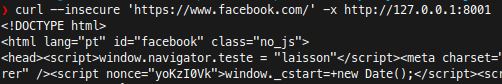

# proxy-with-nodejs
Testando modulo AnyProxy

## install
`npm i`

## run
`npm start`

## test
`curl 'http://httpbin.org/user-agent' -x http://127.0.0.1:8001`
 - Expected:
`{
  "user-agent": "curl/7.58.0"
}
Laisson`

`curl --insecure 'https://www.facebook.com/' -x http://127.0.0.1:8001`
 - Expected:
 `` após o `<head>`
 

## doc
https://anyproxy.io/
